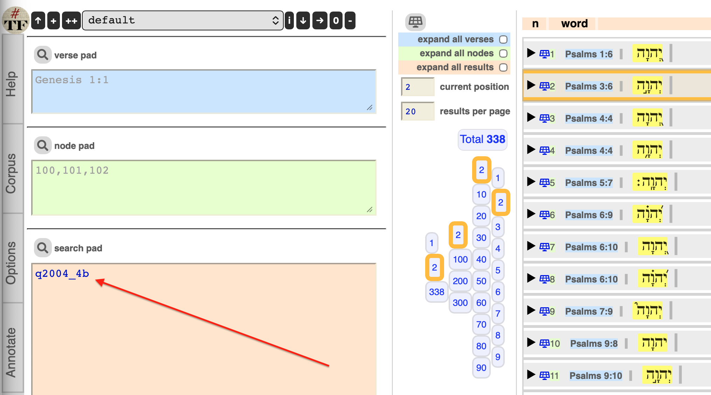

# SHEBANQ

[](https://www.repostatus.org/#active)


[](https://github.com/ETCBC)

## Note on 2026-02-05 by Dirk Roorda

Today I brought SHEBANQ down, backed up the user data, and handed it over to Constantijn
Sikkel of the ETCBC, who is going to host SHEBANQ in the future.

There might be a transition time during which SHEBANQ is hosted under
[shebanq.etcbc.nl](https://shebanq.etcbc.nl).

After that, SHEBANQ will be hosted under its current url
[shebanq.ancient-data.org](https://shebanq.ancient-data.org)

In the meanwhile the data of SHEBANQ is curated as best as I could, see below.

## Status

**The days of shebanq.ancient-data.org as a website are numbered.**

**At some point in the future shebanq will be shut down.**

**However, all public data in it has been curated
and this repo makes it available to you.**

**You can run shebanq on your own computer for personal use,
with the latest data loaded.**

**You can find here the metadata of all
[lexemes](https://etcbc.github.io/shebanq-local/hebrew/word/index.html).**

**You can find here the metadata of all
[published queries](https://etcbc.github.io/shebanq-local/hebrew/query/index.html).**

**You can download the
[results of all published queries](https://github.com/ETCBC/shebanq-local/raw/refs/heads/master/content/qresults.tfx)
and view them in the Text-Fabric browser.**

**Your unpublished queries are also curated, but not publicly disclosed, of course.**

You can ask a member of the ETCBC for a zip file that contains your work on
shebanq, in much the same shape as the curated *public* queries.
If you make such a request, please use the same email addres by which you used to log
in on the SHEBANQ web site.

### Caution

**Do not deploy this version of SHEBANQ on a server.**

Some security features are switched off (email verification) and the admin password
for the web framework, Wep2Py, is in plain sight in the `.env` file.

This deployment is meant for personal computers, where SHEBANQ will run on `localhost`.

## About

*System for HEBrew Text: ANnotations for Queries and Markup*

[SHEBANQ](https://shebanq.ancient-data.org)
was, until ??-??-20?? a website with a search engine for the Hebrew Bible, powered by the
[BHSA](https://github.com/ETCBC/bhsa)
linguistic database, also known as ETCBC or WIVU.

The ETCBC is lead by
[prof. dr. Willem Th. van Peursen](https://research.vu.nl/en/persons/willem-van-peursen).

## History

SHEBANQ was first deployed in 2014, by DANS, for the ETCBC, in the context of CLARIN.

The evolution of SHEBANQ till now can be seen in
[ETCBC/shebanq](https://github.com/ETCBC/shebanq)
which reflects the history of SHEBANQ since October 2017.
It still contains the documentation and lots of useful information.

As of 2023-12-21 SHEBANQ migrated to KNAW/HuC in the context of CLARIAH,
which acts as the successor of CLARIN.

On 2026-03-01 is the retirement date of the maker of SHEBANQ.
This repository is a curated version of SHEBANQ.
It contains the resources to set up a local shebanq on your computer which contains
all the public material that users have contributed over time until the moment
of curation.

However, it is possible that the ETCBC will continue the hosting of SHEBANQ in the
current form. For status updates,
see the
[SHEBANQ Wiki](https://github.com/ETCBC/shebanq/wiki/Important-notice-about-the-future-of-SHEBANQ).

## Local deployment

These are the steps to **get your own shebanq**.
If something goes wrong, consult the [trouble](trouble.md).
For more information about how you can use and maintain your own shebanq,
see the [FAQ](FAQ.md).

If you are a developer, see also [FAQ-dev](FAQ-dev.md).

1.  Install a docker engine that is capable of multi-platform builds,
    we recommend [Docker Desktop](https://www.docker.com/products/docker-desktop/).

1.  Start a bash shell and verify that it can do the `git` command

    ```
    git --version
    ```

1.  Clone this repository:

    ```
    cd to/your/directory/of/choice
    git clone https://github.com/ETCBC/shebanq-local.git
    cd shebanq-local

1.  Start the local shebanq server by

    ```
    ./shebanq.sh up
    ```

    (which is an abbreviation for `docker compose up`)

1.  Open a bash shell in the same directory and do

    ```
    ./shebanq.sh browse
    ```

    and now a browser window opens with the shebanq website in it.

## Inspect query results in the TF browser

Without setting up your own local shebanq, you can still view the results of
published queries in the Text-Fabric browser.
These are the steps to do that:

1.  Install [Python](https://www.python.org)

1.  Install [Text-Fabric](https://github.com/annotation/text-fabric) by
    
    ```
    pip install 'text-fabric[all]'
    ```

1.  Download the
    [results of the public queries in Text-Fabric format](https://github.com/ETCBC/shebanq-local/raw/refs/heads/master/content/qresults.tfx).
    This will end up in your Downloads folder (assuming `~/Downloads`)

1.  Start the TF browser and load the query results:

    ```
    tf ETCBC/bhsa --sets=~/Downloads/qresults.tfx
    ```

1.  In the search box, enter the id and version of a query.

    

# Author

[Dirk Roorda](https://github.com/dirkroorda), working at
[KNAW Humanities Cluster - Digital Infrastructure](https://di.huc.knaw.nl/text-analysis-en.html).

See [team](https://github.com/ETCBC/shebanq/wiki/Team) for a list of people
that have contributed in various ways to the existence of the website SHEBANQ.
